# 📡 Guía del Sistema de Eventos

## 📖 Índice

1. [¿Qué son los Eventos de Dominio?](#qué-son-los-eventos-de-dominio)
2. [Arquitectura del Sistema de Eventos](#arquitectura-del-sistema-de-eventos)
3. [Publicar Eventos](#publicar-eventos)
4. [Suscribirse a Eventos](#suscribirse-a-eventos)
5. [Patrones de Eventos](#patrones-de-eventos)
6. [Ejemplos Prácticos](#ejemplos-prácticos)
7. [Mejores Prácticas](#mejores-prácticas)
8. [Debugging y Troubleshooting](#debugging-y-troubleshooting)

---

## ¿Qué son los Eventos de Dominio?

Los **eventos de dominio** son mensajes que representan algo importante que ha ocurrido en el sistema. Permiten que los dominios se comuniquen sin conocerse directamente.

### Ejemplo de la Vida Real

Imagina un sistema de tienda online:

```
🛒 Dominio de Pedidos: "Se ha creado un pedido"
    ↓
📧 Dominio de Email: Escucha y envía confirmación
💰 Dominio de Pagos: Escucha y procesa el pago  
📦 Dominio de Inventario: Escucha y actualiza stock
```

### Ventajas de los Eventos

- **Desacoplamiento**: Los dominios no se conocen entre sí
- **Escalabilidad**: Fácil agregar nuevos dominios que reaccionen
- **Flexibilidad**: Se pueden modificar reacciones sin afectar el publicador
- **Auditabilidad**: Historial completo de lo que ha pasado en el sistema

---

## Arquitectura del Sistema de Eventos

### Componentes Principales

```mermaid
graph LR
    A[📊 Dominio A] --> B[📡 Event Dispatcher]
    B --> C[📧 Dominio B]
    B --> D[📦 Dominio C]
    B --> E[🔔 Dominio D]
```



### Flujo de Eventos

1. **Publicación**: Un dominio publica un evento
2. **Distribución**: El Event Dispatcher encuentra suscriptores
3. **Entrega**: El evento se envía a todos los suscriptores
4. **Procesamiento**: Cada suscriptor procesa el evento de forma independiente

### Estructura de un Evento

```typescript
interface IDomainEvent {
  eventId: string;           // ID único del evento
  eventName: string;         // Nombre del evento
  domainOrigin: string;      // Dominio que lo publicó
  aggregateId: string;       // ID de la entidad afectada
  aggregateType: string;     // Tipo de entidad
  payload: any;              // Datos del evento
  metadata: {                // Metadatos adicionales
    userId?: number;
    correlationId?: string;
    timestamp: Date;
  };
  occurredAt: Date;          // Cuándo ocurrió
}
```

---

## Publicar Eventos

### Método 1: Usando el Decorador @EventPublisher

```typescript
import { EventPublisher } from "@shared/decorators/event.decorators";
import { IEventDispatcher } from "@shared/interfaces/events.interfaces";

@Service()
export class UsuarioService {
  @EventPublisher()
  private eventDispatcher!: IEventDispatcher;

  async registrarUsuario(datos: any) {
    // 1. Lógica de negocio
    const usuario = await this.crearUsuario(datos);

    // 2. Publicar evento
    await this.eventDispatcher.dispatchDomainEvent(
      "user-management",        // Dominio origen
      "user.registered",        // Nombre del evento  
      {                         // Payload
        userId: usuario.id,
        email: usuario.email,
        nombre: usuario.nombre,
        registradoEn: new Date()
      },
      {                         // Metadata (opcional)
        correlationId: "reg-123",
        source: "mobile_app"
      }
    );

    return usuario;
  }
}
```

### Método 2: Inyección Directa

```typescript
@Service()
export class UsuarioService {
  constructor(
    @Inject("domainEventDispatcher") private eventDispatcher: IEventDispatcher
  ) {}

  async actualizarPerfil(userId: number, datos: any) {
    const usuario = await this.actualizarDatos(userId, datos);

    await this.eventDispatcher.dispatchDomainEvent(
      "user-management",
      "user.profile_updated",
      {
        userId,
        cambios: datos,
        actualizadoEn: new Date()
      }
    );

    return usuario;
  }
}
```

### Método 3: Event Builder (Para Eventos Complejos)

```typescript
await this.eventDispatcher.dispatch(
  this.eventDispatcher
    .createEvent()
    .eventName("learning-content.path.milestone_completed")
    .domain("learning-content")
    .aggregateId(pathId.toString())
    .aggregateType("path")
    .payload({
      userId,
      pathId,
      milestoneId,
      completedAt: new Date(),
      timeTaken: 1800, // segundos
      score: 95
    })
    .metadata({
      userId,
      sessionId: "sess-456",
      deviceType: "mobile"
    })
    .build()
);
```

---

## Suscribirse a Eventos

### Decoradores de Suscripción

```typescript
import { Service } from "typedi";
import { EventSubscriber, OnEvent } from "@shared/decorators/event.decorators";
import { IDomainEvent } from "@shared/interfaces/events.interfaces";

@Service()
@EventSubscriber("NotificationSubscriber")
export class NotificationSubscriber {
  
  // Suscribirse a un evento específico
  @OnEvent("user-management.user.registered")
  async onUsuarioRegistrado(event: IDomainEvent): Promise<void> {
    const { userId, email, nombre } = event.payload;
    
    await this.enviarEmailBienvenida(email, nombre);
    await this.crearNotificacionBienvenida(userId);
  }

  // Suscribirse a múltiples eventos específicos
  @OnEvent(["user.email_verified", "user.profile_updated"])
  async onEventosDePerfilUsuario(event: IDomainEvent): Promise<void> {
    const { userId } = event.payload;
    
    await this.actualizarCacheUsuario(userId);
  }

  // Suscribirse a todos los eventos de un dominio
  @OnEvent("subscription.*")
  async onCualquierEventoSuscripcion(event: IDomainEvent): Promise<void> {
    const { userId } = event.payload;
    
    // Manejar diferentes tipos de eventos de suscripción
    switch (event.eventName) {
      case "subscription.activated":
        await this.enviarConfirmacionPago(userId);
        break;
      case "subscription.cancelled":
        await this.enviarEncuestaCancelacion(userId);
        break;
      case "subscription.renewed":
        await this.enviarFactura(userId);
        break;
    }
  }

  // Suscribirse a eventos de múltiples dominios
  @OnEvent(["user.*", "path.*", "subscription.*"])
  async onEventosMultidominio(event: IDomainEvent): Promise<void> {
    // Registrar actividad del usuario para analytics
    await this.registrarActividadUsuario(event);
  }
}
```

### Decoradores de Conveniencia

```typescript
import { 
  OnUserEvent, 
  OnPathEvent, 
  OnSubscriptionEvent,
  OnNotificationEvent 
} from "@shared/decorators/event.decorators";

@Service()
@EventSubscriber("ConvenienceSubscriber")
export class ConvenienceSubscriber {
  
  @OnUserEvent("registered")  // Equivale a "user-management.user.registered"
  async onUserRegistered(event: IDomainEvent) { /* ... */ }

  @OnPathEvent("completed")   // Equivale a "learning-content.path.completed"
  async onPathCompleted(event: IDomainEvent) { /* ... */ }

  @OnSubscriptionEvent("activated") // Equivale a "billing.subscription.activated"
  async onSubscriptionActivated(event: IDomainEvent) { /* ... */ }
}
```

### Suscriptor con Opciones Avanzadas

```typescript
@Service()
@EventSubscriber("AdvancedSubscriber")
export class AdvancedSubscriber {
  
  // Handler con reintentos y cola de fallos
  @OnEvent("payment.failed", { 
    retryCount: 3, 
    deadLetterQueue: true,
    priority: 10 
  })
  async onPaymentFailedConReintentos(event: IDomainEvent): Promise<void> {
    // Este método se reintentará 3 veces si falla
    await this.procesarPagoFallido(event.payload);
  }

  // Handler condicional
  @OnEvent("path.*")
  async onPathEventsCondicional(event: IDomainEvent): Promise<void> {
    // Solo procesar ciertos eventos
    if (this.debeProcesar(event)) {
      await this.procesarEvento(event);
    }
  }

  private debeProcesar(event: IDomainEvent): boolean {
    return ["path.enrolled", "path.completed"].includes(event.eventName);
  }
}
```

---

## Patrones de Eventos

### 1. Patrón de Naming

```typescript
// Estructura: dominio.entidad.accion
"user-management.user.registered"
"learning-content.path.completed"
"billing.subscription.activated"
"notifications.push.sent"

// Para eventos de estado
"user-management.user.status_changed"
"billing.subscription.status_changed"

// Para eventos de proceso
"learning-content.assessment.started"
"learning-content.assessment.completed"
"billing.payment.processing"
"billing.payment.completed"
```

### 2. Patrón de Comodines

```typescript
// Todos los eventos de un dominio
@OnEvent("user-management.*")

// Todos los eventos de una entidad específica
@OnEvent("user-management.user.*")

// Todos los eventos de una acción en cualquier dominio
@OnEvent("*.*.registered")

// Todos los eventos
@OnEvent("*")
```

### 3. Patrón Saga (Coordinación de Procesos)

```typescript
@Service()
@EventSubscriber("RegistrationSaga")
export class RegistrationSaga {
  
  @OnEvent("user-management.user.registered")
  async step1_UsuarioRegistrado(event: IDomainEvent): Promise<void> {
    const { userId, email } = event.payload;
    
    // Enviar email de verificación
    await this.eventDispatcher.dispatchDomainEvent(
      "email",
      "verification.requested",
      { userId, email }
    );
  }

  @OnEvent("email.verification.sent")
  async step2_EmailEnviado(event: IDomainEvent): Promise<void> {
    const { userId } = event.payload;
    
    // Crear notificación de seguimiento
    await this.eventDispatcher.dispatchDomainEvent(
      "notifications",
      "reminder.scheduled",
      { 
        userId, 
        type: "email_verification",
        scheduledFor: new Date(Date.now() + 24 * 60 * 60 * 1000) // 24 horas
      }
    );
  }

  @OnEvent("user-management.user.email_verified")
  async step3_EmailVerificado(event: IDomainEvent): Promise<void> {
    const { userId } = event.payload;
    
    // Completar onboarding
    await this.eventDispatcher.dispatchDomainEvent(
      "user-management",
      "onboarding.completed",
      { userId, completedAt: new Date() }
    );
  }
}
```

### 4. Patrón de Agregación de Eventos

```typescript
@Service()
@EventSubscriber("AnalyticsAggregator")
export class AnalyticsAggregator {
  private eventBatch: IDomainEvent[] = [];
  private batchTimer?: NodeJS.Timeout;

  @OnEvent("*") // Escuchar todos los eventos
  async onAnyEvent(event: IDomainEvent): Promise<void> {
    this.eventBatch.push(event);

    // Procesar por lotes cuando llegue a 100 eventos
    if (this.eventBatch.length >= 100) {
      await this.processBatch();
    } else {
      // O procesar cada 5 segundos
      this.scheduleBatchProcessing();
    }
  }

  private async processBatch(): Promise<void> {
    if (this.eventBatch.length === 0) return;

    const batch = [...this.eventBatch];
    this.eventBatch = [];

    await this.analyticsService.processBatch(batch);
  }

  private scheduleBatchProcessing(): void {
    if (this.batchTimer) return;

    this.batchTimer = setTimeout(async () => {
      await this.processBatch();
      this.batchTimer = undefined;
    }, 5000);
  }
}
```

---

## Ejemplos Prácticos

### Ejemplo 1: Flujo de Registro de Usuario

```typescript
// 1. Usuario se registra
POST /auth/register → AuthController.register()

// 2. Se publica evento
await this.eventDispatcher.dispatchDomainEvent(
  "authentication",
  "user.registered",
  { userId: newUser.id, email: newUser.email }
);

// 3. Múltiples dominios reaccionan
@OnEvent("authentication.user.registered")
async onUserRegistered(event) {
  // Email: Enviar bienvenida
  // Notifications: Crear notificación
  // Gamification: Otorgar logro "Primera vez"
  // Analytics: Registrar conversión
}
```

### Ejemplo 2: Flujo de Completar Ruta de Aprendizaje

```typescript
// 1. Usuario completa última milestone
await this.milestoneService.complete(userId, milestoneId);

// 2. Se detecta que completó toda la ruta
if (pathCompleted) {
  await this.eventDispatcher.dispatchDomainEvent(
    "learning-content",
    "path.completed",
    {
      userId,
      pathId,
      completedAt: new Date(),
      totalTime: this.calculateTotalTime(userId, pathId),
      finalScore: this.calculateScore(userId, pathId)
    }
  );
}

// 3. Reacciones automáticas
@OnEvent("learning-content.path.completed")
async onPathCompleted(event) {
  const { userId, pathId, finalScore } = event.payload;
  
  // Gamification: Otorgar logro
  await this.achievementService.unlock(userId, "path_master");
  
  // Notifications: Felicitaciones
  await this.notificationService.send(userId, "¡Felicidades por completar la ruta!");
  
  // Analytics: Registrar métrica
  await this.analyticsService.recordCompletion(userId, pathId, finalScore);
  
  // Email: Enviar certificado
  await this.emailService.sendCertificate(userId, pathId);
}
```

### Ejemplo 3: Flujo de Procesamiento de Pago

```typescript
// Saga de procesamiento de pago
@Service()
@EventSubscriber("PaymentProcessingSaga")
export class PaymentProcessingSaga {
  
  @OnEvent("billing.payment.initiated")
  async onPaymentInitiated(event: IDomainEvent): Promise<void> {
    const { paymentId, userId, amount } = event.payload;
    
    // Validar datos del usuario
    const user = await this.userService.validate(userId);
    
    if (user.isValid) {
      await this.eventDispatcher.dispatchDomainEvent(
        "billing",
        "payment.user_validated",
        { paymentId, userId, amount }
      );
    } else {
      await this.eventDispatcher.dispatchDomainEvent(
        "billing",
        "payment.user_validation_failed",
        { paymentId, userId, reason: user.failureReason }
      );
    }
  }

  @OnEvent("billing.payment.user_validated")
  async onUserValidated(event: IDomainEvent): Promise<void> {
    const { paymentId, amount } = event.payload;
    
    // Procesar con Stripe
    const result = await this.stripeService.charge(amount);
    
    if (result.success) {
      await this.eventDispatcher.dispatchDomainEvent(
        "billing",
        "payment.succeeded",
        { 
          paymentId, 
          transactionId: result.transactionId,
          processedAt: new Date()
        }
      );
    } else {
      await this.eventDispatcher.dispatchDomainEvent(
        "billing",
        "payment.failed",
        { 
          paymentId, 
          error: result.error,
          failedAt: new Date()
        }
      );
    }
  }

  @OnEvent("billing.payment.succeeded")
  async onPaymentSucceeded(event: IDomainEvent): Promise<void> {
    const { paymentId, userId } = event.payload;
    
    // Activar suscripción
    await this.eventDispatcher.dispatchDomainEvent(
      "billing",
      "subscription.activated",
      { userId, activatedAt: new Date() }
    );
    
    // Enviar recibo
    await this.eventDispatcher.dispatchDomainEvent(
      "email",
      "receipt.send_requested",
      { userId, paymentId }
    );
  }
}
```

---

## Mejores Prácticas

### ✅ Naming de Eventos

```typescript
// ✅ BUENO: Descriptivo y específico
"user-management.user.profile_updated"
"learning-content.milestone.assessment_completed"
"billing.subscription.payment_failed"

// ❌ MALO: Vago o genérico
"user.updated"
"thing.happened"
"process.completed"
```

### ✅ Payload de Eventos

```typescript
// ✅ BUENO: Información rica y útil
{
  userId: 123,
  pathId: 456,
  milestoneId: 789,
  completedAt: "2024-01-15T10:30:00Z",
  timeTaken: 1800, // segundos
  score: 95,
  difficulty: "intermediate",
  firstAttempt: true
}

// ❌ MALO: Información mínima
{
  id: 123
}
```

### ✅ Manejo de Errores

```typescript
@Service()
@EventSubscriber("RobustSubscriber")
export class RobustSubscriber {
  
  @OnEvent("user.registered")
  async onUserRegistered(event: IDomainEvent): Promise<void> {
    try {
      await this.processRegistration(event.payload);
    } catch (error) {
      // Log el error pero no lo relances
      this.logger.error("Failed to process registration", {
        eventId: event.eventId,
        userId: event.payload.userId,
        error: error.message,
      });

      // Opcional: Publicar evento de error
      await this.eventDispatcher.dispatchDomainEvent(
        "notifications",
        "processing.failed",
        {
          originalEvent: event.eventName,
          userId: event.payload.userId,
          error: error.message,
          failedAt: new Date()
        }
      );
    }
  }
}
```

### ✅ Eventos Idempotentes

```typescript
// Eventos deben poder procesarse múltiples veces sin efectos secundarios
@OnEvent("user.email_verified")
async onEmailVerified(event: IDomainEvent): Promise<void> {
  const { userId } = event.payload;
  
  // Verificar si ya se procesó
  const alreadyProcessed = await this.checkIfProcessed(event.eventId);
  if (alreadyProcessed) {
    return; // Salir sin hacer nada
  }
  
  // Procesar
  await this.unlockPremiumFeatures(userId);
  
  // Marcar como procesado
  await this.markAsProcessed(event.eventId);
}
```

### ✅ Testing de Eventos

```typescript
describe("UserRegistrationFlow", () => {
  let eventDispatcher: jest.Mocked<IEventDispatcher>;
  let userService: UserService;

  beforeEach(() => {
    eventDispatcher = {
      dispatchDomainEvent: jest.fn(),
    } as any;
    userService = new UserService(eventDispatcher);
  });

  it("should publish user.registered event", async () => {
    const userData = { email: "test@test.com", name: "Test User" };
    
    await userService.register(userData);

    expect(eventDispatcher.dispatchDomainEvent).toHaveBeenCalledWith(
      "user-management",
      "user.registered",
      expect.objectContaining({
        email: userData.email,
        userId: expect.any(Number),
      })
    );
  });
});
```

---

## Debugging y Troubleshooting

### Activar Logs de Debug

```typescript
// En cualquier suscriptor, agregar logs
@OnEvent("*") // Escuchar todos los eventos para debug
async debugAllEvents(event: IDomainEvent): Promise<void> {
  console.log("🔍 EVENT DEBUG:", {
    eventName: event.eventName,
    domain: event.domainOrigin,
    payload: event.payload,
    timestamp: event.occurredAt
  });
}
```

### Endpoint de Salud para Eventos

```typescript
@JsonController("/admin/events")
export class EventHealthController {
  
  @Get("/health")
  getEventSystemHealth() {
    return {
      subscribers: this.eventDispatcher.getSubscriberStats(),
      recentEvents: this.eventDispatcher.getEventHistory(10),
      systemStatus: "healthy"
    };
  }

  @Get("/history")
  getEventHistory(@QueryParam("limit") limit: number = 100) {
    return this.eventDispatcher.getEventHistory(limit);
  }
}
```

### Problemas Comunes

| Problema | Síntoma | Solución |
|----------|---------|----------|
| **Eventos no se publican** | Suscriptores no reaccionan | Verificar que `@EventPublisher()` esté configurado |
| **Suscriptores no registran** | `Service not found` | Verificar `@Service()` en suscriptor |
| **Eventos duplicados** | Acciones se ejecutan múltiples veces | Implementar idempotencia |
| **Performance lenta** | Sistema se ralentiza | Usar procesamiento asíncrono/batch |

---

## Monitoreo y Observabilidad

### Métricas Importantes

```typescript
@Service()
@EventSubscriber("MetricsCollector")
export class MetricsCollector {
  
  @OnEvent("*")
  async collectMetrics(event: IDomainEvent): Promise<void> {
    // Contar eventos por dominio
    this.metricsService.incrementCounter("events.processed", {
      domain: event.domainOrigin,
      eventName: event.eventName,
    });

    // Medir tiempo de procesamiento
    const startTime = Date.now();
    // ... procesar evento ...
    const duration = Date.now() - startTime;
    
    this.metricsService.recordDuration("event.processing_time", duration, {
      eventName: event.eventName,
    });
  }
}
```

### Dashboard de Eventos

```typescript
// Endpoint para dashboard en tiempo real
@Get("/admin/events/dashboard")
async getEventDashboard() {
  return {
    totalEventsToday: await this.getEventCount(today),
    eventsByDomain: await this.getEventsByDomain(),
    topEvents: await this.getTopEvents(),
    failureRate: await this.getFailureRate(),
    averageProcessingTime: await this.getAverageProcessingTime()
  };
}
```

---

## Próximos Pasos

Ahora que dominas el sistema de eventos, continúa con:

1. **[Guía de Testing](./ddd_testing_guide_es.md)** - Cómo testear eventos y dominios
2. **[Guía de Performance](./ddd_performance_guide_es.md)** - Optimización de eventos
3. **[Guía de Troubleshooting](./ddd_troubleshooting_es.md)** - Solución de problemas

---

**¡Ahora puedes crear sistemas de comunicación robustos entre dominios! 🎯**