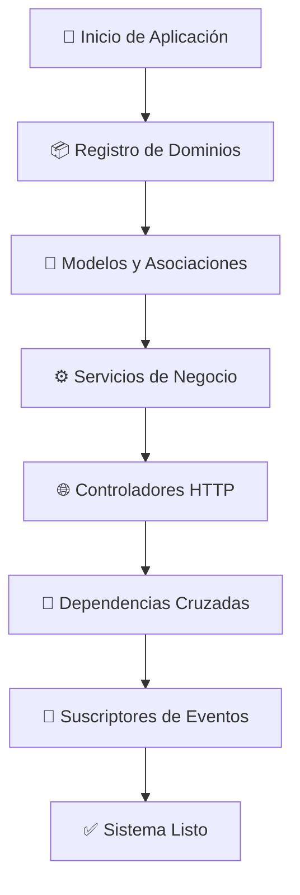

# 🏗️ Guía de Introducción al Sistema DDD de Pathway

## 📖 Índice

1. [¿Qué es Domain-Driven Design (DDD)?](#qué-es-domain-driven-design-ddd)
2. [Arquitectura del Sistema Pathway](#arquitectura-del-sistema-pathway)
3. [Estructura de Dominios](#estructura-de-dominios)
4. [Flujo de Inicialización](#flujo-de-inicialización)
5. [Conceptos Clave](#conceptos-clave)
6. [Ventajas del Sistema](#ventajas-del-sistema)

---

## ¿Qué es Domain-Driven Design (DDD)?

**Domain-Driven Design** es un enfoque de desarrollo de software que se centra en:

- **Separar la lógica de negocio** en dominios específicos
- **Crear límites claros** entre diferentes áreas funcionales
- **Usar un lenguaje común** entre desarrolladores y expertos del dominio
- **Mantener el código organizado** y escalable

### Ejemplo Simple

Imagina una tienda online:
- **Dominio de Usuarios**: Registro, login, perfiles
- **Dominio de Productos**: Catálogo, inventario, precios
- **Dominio de Pagos**: Procesamiento, facturación
- **Dominio de Envíos**: Logística, tracking

Cada dominio se enfoca en **una sola responsabilidad** y tiene **sus propios modelos, servicios y controladores**.

---

## Arquitectura del Sistema Pathway

Nuestro sistema DDD está compuesto por **15 dominios principales**:

```
🏠 user-management     → Gestión de usuarios y perfiles
🎮 gamification        → Logros, puntos, insignias
💳 billing            → Suscripciones y pagos
📧 email              → Envío de correos electrónicos
📚 learning-content   → Rutas de aprendizaje y contenido
👥 social             → Interacciones sociales y seguidores
🔔 notifications      → Notificaciones push y en app
⏰ routines           → Rutinas y hábitos de usuarios
💬 feedback           → Comentarios y sugerencias
🔐 authentication     → Login, registro, seguridad
📊 analytics          → Métricas y estadísticas
📈 progress-tracking  → Seguimiento de progreso en rutas
⚙️  system            → Variables del sistema
🤖 ai-services        → Inteligencia artificial
📋 admin-activity-logging → Logs de actividad administrativa
```

### Comunicación Entre Dominios

Los dominios **NO** se comunican directamente. Usan un **sistema de eventos**:

```
Dominio A ---> [Evento] ---> Dominio B
```

**Ejemplo:**
```
user-management  ---> "usuario.registrado" ---> notifications
                 ---> "usuario.registrado" ---> email  
                 ---> "usuario.registrado" ---> gamification
```

---

## Estructura de Dominios

Cada dominio sigue una estructura estándar:

```
src/domains/nombre-dominio/
├── controllers/          # Endpoints HTTP (API REST)
│   ├── usuario.controller.ts
│   └── admin.controller.ts
├── services/            # Lógica de negocio
│   ├── usuario.service.ts
│   └── validacion.service.ts
├── models/              # Modelos de base de datos
│   ├── usuario.model.ts
│   ├── associations.ts  # Relaciones entre modelos
│   └── index.ts
├── subscribers/         # Manejadores de eventos
│   └── usuario.subscriber.ts
├── interfaces/          # Contratos y tipos
│   ├── external.interfaces.ts  # Para otros dominios
│   └── internal.interfaces.ts  # Para uso interno
├── validators/          # Validación de datos
│   └── usuario.validators.ts
├── dtos/               # Objetos de transferencia de datos
│   └── usuario.dtos.ts
├── dominio.domain.ts   # Configuración del dominio
└── index.ts           # Punto de entrada y registro
```

### Responsabilidades por Carpeta

| Carpeta | Responsabilidad | Ejemplo |
|---------|----------------|---------|
| **controllers** | Recibir requests HTTP, validar entrada, devolver respuestas | `POST /users` → UserController.create() |
| **services** | Lógica de negocio, reglas del dominio, coordinar operaciones | Validar email único, aplicar reglas de negocio |
| **models** | Estructura de datos, relaciones con BD, validaciones de modelo | User, UserProfile, UserDevice |
| **subscribers** | Reaccionar a eventos de otros dominios | Enviar email cuando usuario se registra |
| **interfaces** | Definir contratos entre dominios | IUserRepository, IEmailService |

---

## Flujo de Inicialización

El sistema se inicializa en **6 fases ordenadas**:

### Fase 1: Registro de Dominios
```
DomainRegistry → Importa todos los dominios → Cada dominio se auto-registra
```

### Fase 2: Inicialización de Modelos
```
Cada dominio inicializa sus modelos y asociaciones internas
```

### Fase 3: Inicialización de Servicios
```
Se instancian todos los servicios de negocio
```

### Fase 4: Configuración de Dependencias Cruzadas
```
Se establecen las relaciones entre modelos de diferentes dominios
```

### Fase 5: Registro de Controladores
```
Se registran todos los endpoints HTTP
```

### Fase 6: Registro de Suscriptores de Eventos
```
Se activa el sistema de eventos entre dominios
```

### Visualización del Flujo



---

## Conceptos Clave

### 1. **Domain Manager**
- **Qué es**: El "cerebro" que coordina todos los dominios
- **Responsabilidad**: Registrar, inicializar y gestionar el ciclo de vida de los dominios
- **Ubicación**: `src/shared/di/domain.manager.ts`

### 2. **Domain Registry**
- **Qué es**: El "catálogo" que importa todos los dominios disponibles
- **Responsabilidad**: Descubrir e importar automáticamente todos los dominios
- **Ubicación**: `src/shared/di/domain.registry.ts`

### 3. **Bootstrap**
- **Qué es**: El "coordinador" de la inicialización completa
- **Responsabilidad**: Orquestar el arranque de infraestructura y dominios
- **Ubicación**: `src/shared/di/bootstrap.ts`

### 4. **Event System**
- **Qué es**: Sistema de comunicación asíncrona entre dominios
- **Ventaja**: Los dominios pueden comunicarse sin conocerse directamente
- **Ejemplo**: 
  ```typescript
  // Publicar evento
  await eventDispatcher.dispatchDomainEvent(
    "user-management",
    "user.registered", 
    { userId: 123, email: "user@example.com" }
  );
  
  // Suscribirse a evento
  @OnEvent("user-management.user.registered")
  async onUserRegistered(event) {
    await this.sendWelcomeEmail(event.payload.email);
  }
  ```

### 5. **Dependency Injection**
- **Qué es**: Sistema que proporciona dependencias automáticamente
- **Herramienta**: TypeDI
- **Ejemplo**:
  ```typescript
  @Service()
  export class UserService {
    constructor(
      @Inject("userRepository") private userRepo: IUserRepository
    ) {}
  }
  ```

---

## Ventajas del Sistema

### ✅ **Para Desarrolladores**

1. **Código Organizado**: Cada funcionalidad tiene su lugar específico
2. **Fácil de Testear**: Los dominios se pueden probar de forma aislada
3. **Rápido de Entender**: La estructura es predecible y consistente
4. **Fácil de Extender**: Agregar nuevas funciones es simple y claro

### ✅ **Para el Negocio**

1. **Escalabilidad**: Nuevos dominios se pueden agregar sin afectar existentes
2. **Mantenimiento**: Los bugs son fáciles de localizar y corregir
3. **Flexibilidad**: Se pueden modificar dominios independientemente
4. **Rendimiento**: Solo se cargan los dominios necesarios

### ✅ **Para el Equipo**

1. **Trabajo Paralelo**: Diferentes desarrolladores pueden trabajar en diferentes dominios
2. **Onboarding Rápido**: Los nuevos desarrolladores pueden enfocarse en un dominio
3. **Menos Conflictos**: Menor probabilidad de conflictos en Git
4. **Documentación Clara**: Cada dominio documenta sus responsabilidades

---

## Próximos Pasos

Ahora que entiendes la arquitectura general, continúa con:

1. **[Guía de Desarrollo de Dominios](./ddd_development_guide_es.md)** - Cómo crear y modificar dominios
2. **[Guía del Sistema de Eventos](./ddd_events_guide_es.md)** - Comunicación entre dominios
3. **[Guía de Mejores Prácticas](./ddd_best_practices_es.md)** - Patrones y convenciones
4. **[Guía de Troubleshooting](./ddd_troubleshooting_es.md)** - Solución de problemas comunes

---

## Recursos Adicionales

- **Documentación oficial DDD**: [Domain-Driven Design Community](https://dddcommunity.org/)
- **TypeScript**: [Documentación oficial](https://www.typescriptlang.org/)
- **TypeDI**: [Documentación de inyección de dependencias](https://github.com/typestack/typedi)
- **Sequelize**: [ORM para base de datos](https://sequelize.org/)

---

**¡Bienvenido al equipo de desarrollo de Pathway! 🚀**