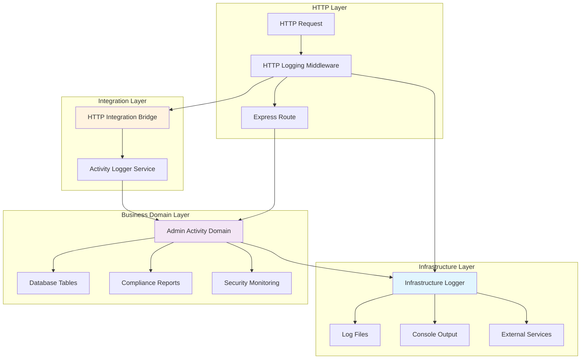
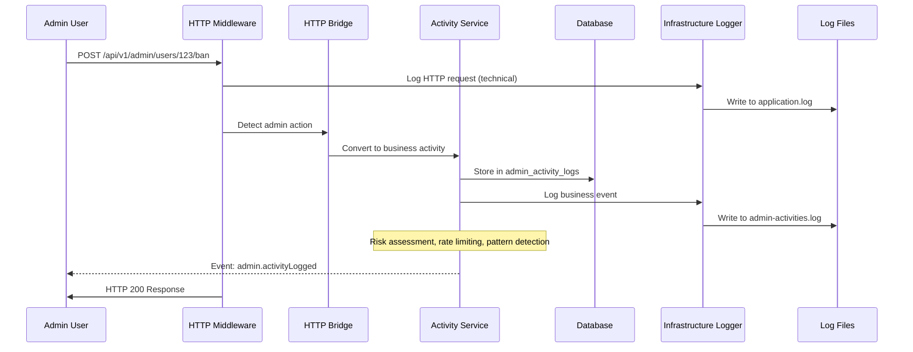

# 🎯 Complete Logging Architecture Guide

## Table of Contents

1. [Overview](#overview)
2. [Architecture Components](#architecture-components)
3. [Infrastructure Logger](#1-infrastructure-logger)
4. [HTTP Logging Middleware](#2-http-logging-middleware)
5. [Admin Activity Domain](#3-admin-activity-domain)
6. [HTTP Integration Bridge](#4-http-integration-bridge)
7. [Activity Logger Service](#5-activity-logger-service)
8. [How Components Link Together](#how-components-link-together)
9. [Data Flow Examples](#data-flow-examples)
10. [Usage Decision Matrix](#usage-decision-matrix)
11. [Best Practices](#best-practices)
12. [Common Pitfalls](#common-pitfalls)

## Overview

Your application has a **two-tier logging architecture**:

- **🔧 Technical Logging**: Infrastructure Logger (files, console, external services)
- **🏢 Business Logging**: Admin Activity Domain (database, compliance, audit)

These work together but serve **different purposes** and have **different outputs**.

## Architecture Components



## 1. Infrastructure Logger

**Location**: `src/infrastructure/logging/logger.ts`  
**Purpose**: Technical system logging (files, console, monitoring)  
**Output**: Log files, console, external services  
**Data**: Technical events, performance, errors, debugging

### Key Features

- **Winston-based** structured logging
- **Multiple transports** (console, files, external services)
- **Category-based filtering** for different log types
- **Environment-aware** configuration
- **File rotation** and size management

### Usage Examples

```typescript
import logger from "@infrastructure/logging/logger";
import { Logger } from "@infrastructure/logging/logger";

// ✅ Basic logging
logger.info("User authenticated", { userId: 123, method: "oauth" });
logger.error("Database error", { error: error.message, query: "SELECT..." });
logger.warn("Cache miss", { key: "user:123", duration: "200ms" });

// ✅ Category-specific logging (static methods)
Logger.logAdminActivity("Admin action performed", {
  adminId: 1,
  action: "user_ban",
  targetUserId: 2,
});

Logger.logSecurity("Failed login attempt", {
  ip: "192.168.1.1",
  attempts: 3,
});

Logger.logPerformance("Slow API response", {
  endpoint: "/api/users",
  duration: 2500,
});

Logger.logDatabase("Query executed", {
  query: "SELECT * FROM users",
  duration: 45,
});

Logger.logTechnical("System event", {
  component: "cache",
  event: "cleanup",
});

// ✅ Domain-specific loggers
const gamificationLogger = Logger.createDomainLogger("gamification");
gamificationLogger.info("Streak updated", { userId: 123, newStreak: 5 });

const serviceLogger = Logger.createServiceLogger("StreakService");
serviceLogger.debug("Processing streak calculation", { userId: 123 });
```

### Configuration

```typescript
// Environment variables
LOG_LEVEL=info                    // debug, info, warn, error
LOG_FILE_ENABLED=true            // Enable file logging
LOG_FILE_PATH=./logs             // Log file directory
SILENT_TESTS=true                // Disable logging in tests
```

### Output Files

- `./logs/application.log` - All application events
- `./logs/error.log` - Error events only
- `./logs/admin-activities.log` - Admin activity events (filtered)
- `./logs/security.log` - Security events (filtered)
- `./logs/exceptions.log` - Uncaught exceptions
- `./logs/rejections.log` - Unhandled promise rejections

### ⚠️ Important: Does NOT Log to Database

The `Logger.logAdminActivity()` method only writes to **log files**, not the database. For database logging, use the Admin Activity Domain.

## 2. HTTP Logging Middleware

**Location**: `src/shared/middleware/monitoring/logging.middleware.ts`  
**Purpose**: HTTP request/response logging + auto admin activity capture  
**Output**: Technical logs + triggers business logging  
**Data**: Request details, response times, status codes

### Key Features

- **Technical HTTP logging** (all requests/responses)
- **Automatic admin activity detection** for business logging
- **Performance monitoring** (slow requests, errors)
- **Request sanitization** (sensitive data removal)
- **Integration bridge** to admin activity domain

### Usage Examples

```typescript
import {
  requestLogging,
  productionLogging,
  detailedLogging,
  adminActivityLogging, // ⭐ NEW: Auto admin activity capture
} from "@shared/middleware/monitoring/logging.middleware";

// ✅ Apply to Express app
app.use(productionLogging); // Production: minimal logging
app.use(detailedLogging); // Development: full logging
app.use(requestLogging); // Standard logging

// ✅ Admin activity auto-capture (RECOMMENDED)
app.use("/api/v1/admin", adminActivityLogging); // Auto-capture admin actions
app.use("/api/v1/system", adminActivityLogging); // Auto-capture system actions
app.use("/api/v1/users", adminActivityLogging); // Auto-capture user management

// ✅ Custom configuration
const customLogging = createRequestLogging({
  logLevel: "debug",
  includeBody: true,
  includeHeaders: false,
  enableAdminActivityCapture: true, // Enable business activity capture
  bodyMaxLength: 2000,
  skipPaths: ["/health", "/metrics"],
});
app.use("/api/v1/sensitive", customLogging);
```

### What Gets Logged

**Technical Logs (Always)**:

```json
{
  "type": "http_request",
  "category": "technical",
  "method": "POST",
  "url": "/api/v1/admin/users/123/ban",
  "statusCode": 200,
  "responseTime": 245,
  "userId": 1,
  "userRole": "admin",
  "ip": "192.168.1.100"
}
```

**Business Activity (When Admin + Enabled)**:

- Automatically triggers Admin Activity Domain logging
- Creates structured business activity records
- Includes risk assessment and audit trail

## 3. Admin Activity Domain

**Location**: `src/domains/admin-activity-logging/`  
**Purpose**: Business activity logging for compliance and audit  
**Output**: Database tables, compliance reports  
**Data**: Admin actions, risk levels, audit trails

### Components

- **Services**: Business logic for activity logging
- **Models**: Database tables for activity storage
- **Controllers**: Admin endpoints for viewing/managing activities
- **Middleware**: Explicit business activity capture
- **Subscribers**: Event-driven activity processing

### Database Tables

- `admin_activity_logs` - Admin actions with full audit trail
- `user_activity_logs` - User actions for analytics

### Middleware Usage

```typescript
import {
  withAdminActivityLogging,
  LogAdminActivity,
  smartAdminActivityLogging
} from "@domains/admin-activity-logging/middleware/activity-logging.middleware";

// ✅ Method 1: Explicit middleware (most control)
@Post("/ban/:id")
@UseBefore(withAdminActivityLogging(
  "user_ban",                      // Action type
  "user_management",               // Category
  "Permanently banned user account", // Description
  {
    riskLevel: "high",
    requiresReview: true,
    extractTargetUserId: (req) => parseInt(req.params.id),
    extractBeforeState: (req) => ({ reason: req.body.reason }),
    extractAfterState: (req, res) => ({ success: res.statusCode < 400 })
  }
))
async banUser(@Param("id") userId: number, @Body() data: any) {
  await this.userService.banUser(userId, data.reason);
  return { success: true };
}

// ✅ Method 2: Decorator (clean syntax)
@LogAdminActivity(
  "system_config_update",
  "system_admin",
  "Updated critical system configuration",
  {
    riskLevel: "critical",
    requiresReview: true,
    skipHttpCapture: false
  }
)
@Put("/config")
async updateSystemConfig(@Body() config: any) {
  return await this.systemService.updateConfig(config);
}

// ✅ Method 3: Smart logging (prevents duplicates)
@Post("/bulk-delete")
@UseBefore(smartAdminActivityLogging(
  "bulk_content_delete",
  "content_moderation",
  "Performed bulk deletion of content items",
  {
    riskLevel: "high",
    requiresReview: true,
    preferExplicitLogging: true,    // Force explicit over HTTP auto-capture
    extractTargetEntity: (req) => ({ type: "BulkOperation", id: Date.now() })
  }
))
async bulkDeleteContent(@Body() { ids }: { ids: number[] }) {
  return await this.contentService.bulkDelete(ids);
}
```

### Service Usage

```typescript
import ActivityLoggerService from "@domains/admin-activity-logging/services/activity-logger.service";

@Service()
export class UserManagementService {
  constructor(private activityLogger: ActivityLoggerService) {}

  async promoteToAdmin(adminUserId: number, targetUserId: number) {
    // Business logic
    await this.userRepository.update(targetUserId, { role: "admin" });

    // ✅ Manual business activity logging
    await this.activityLogger.logAdminActivity({
      adminUserId,
      targetUserId,
      actionType: "user_promote",
      actionCategory: "user_management",
      actionDescription: "Promoted user to administrator role",
      beforeState: { role: "user" },
      afterState: { role: "admin" },
      success: true,
      riskLevel: "critical",
      requiresReview: true,
      metadata: {
        promotionReason: "Exceptional performance",
        approvedBy: adminUserId,
      },
    });
  }
}
```

## 4. HTTP Integration Bridge

**Location**: `src/domains/admin-activity-logging/utils/http-integration.ts`  
**Purpose**: Convert HTTP requests to business activities  
**Output**: Triggers Activity Logger Service  
**Data**: HTTP context → Business activity format

### How It Works

1. **HTTP Middleware** detects admin action
2. **Calls** `logAdminActivityFromHttp()`
3. **Extracts** business context from HTTP request
4. **Triggers** Activity Logger Service
5. **Creates** database record

### Automatic Extraction

```typescript
// ✅ Automatically extracts from HTTP request:
// URL: POST /api/v1/admin/users/123/ban
// Body: { reason: "Spam violation" }
// Admin: { id: 1, role: "admin" }

// ✅ Becomes business activity:
{
  adminUserId: 1,
  targetUserId: 123,
  actionType: "post_api_v1_admin_users_ban",
  actionCategory: "user_management",
  actionDescription: "Failed to performed POST on user 123", // Based on success
  targetEntityType: "User",
  targetEntityId: 123,
  success: false,  // Based on HTTP status code
  riskLevel: "high", // Based on action type + success
  requiresReview: true,
  metadata: {
    httpMethod: "POST",
    route: "/api/v1/admin/users/:id/ban",
    statusCode: 500,
    responseTime: 245,
    capturedVia: "http_middleware"
  }
}
```

### Entity Detection

- `/users/123` → `{ type: "User", id: 123 }`
- `/posts/456` → `{ type: "Post", id: 456 }`
- `/paths/789` → `{ type: "Path", id: 789 }`
- `/system/config` → `{ type: "SystemVariable", id: ... }`

### Risk Assessment

- `DELETE` → High risk
- `PUT/PATCH` → Medium risk
- `POST` → Medium risk
- `GET` → Low risk
- **Failed actions** → +1 risk level

## 5. Activity Logger Service

**Location**: `src/domains/admin-activity-logging/services/activity-logger.service.ts`  
**Purpose**: Core business logic for activity logging  
**Output**: Database records, events, notifications  
**Data**: Structured business activities

### Key Features

- **Risk assessment** based on action type and context
- **Rate limiting** to prevent abuse
- **Suspicious pattern detection** (rapid-fire actions, bulk failures)
- **Review requirements** based on risk level
- **Event publishing** for real-time monitoring
- **Batch processing** for performance

### Direct Usage

```typescript
import ActivityLoggerService from "@domains/admin-activity-logging/services/activity-logger.service";

@Service()
export class AdminController {
  constructor(private activityLogger: ActivityLoggerService) {}

  async sensitiveOperation(adminUserId: number) {
    try {
      // Your business logic here
      const result = await this.performOperation();

      // ✅ Log successful activity
      await this.activityLogger.logAdminActivity({
        adminUserId,
        actionType: "sensitive_operation",
        actionCategory: "system_admin",
        actionDescription: "Performed sensitive system operation",
        success: true,
        riskLevel: "critical",
        requiresReview: true,
        metadata: {
          operationType: "data_export",
          recordCount: result.count,
          duration: result.duration,
        },
      });

      return result;
    } catch (error) {
      // ✅ Log failed activity
      await this.activityLogger.logAdminActivity({
        adminUserId,
        actionType: "sensitive_operation",
        actionCategory: "system_admin",
        actionDescription: "Failed to perform sensitive operation",
        success: false,
        errorMessage: error.message,
        riskLevel: "critical",
        requiresReview: true,
      });

      throw error;
    }
  }

  async bulkUserOperation(adminUserId: number, userIds: number[]) {
    const activities = userIds.map((userId) => ({
      adminUserId,
      targetUserId: userId,
      actionType: "bulk_user_update",
      actionCategory: "user_management" as const,
      actionDescription: `Updated user ${userId} in bulk operation`,
      success: true,
      riskLevel: "medium" as const,
      requiresReview: false,
    }));

    // ✅ Batch logging for performance
    const result = await this.activityLogger.batchLogAdminActivities(
      activities
    );
    console.log(
      `Logged ${result.processedCount}/${activities.length} activities`
    );
  }
}
```

### Automatic Features

#### Risk Assessment

```typescript
// Automatically calculates risk based on:
// - Action type (user_ban = high, user_view = low)
// - Success/failure (failed = +risk)
// - Target user type (admin targets = +risk)
// - Frequency (rapid actions = +risk)
```

#### Rate Limiting

```typescript
// Automatically enforced limits:
// - admin_promote: 5/hour
// - user_ban: 10/hour
// - bulk_delete: 3/hour
// - data_export: 5/hour
// - default: 100/hour
```

#### Suspicious Pattern Detection

```typescript
// Automatically detects:
// - Rapid-fire: >20 actions/hour
// - Bulk failures: >5 failures/hour
// - Unusual hours: 2-6 AM activity
// - High-risk sequences: >3 high-risk actions/hour
```

## How Components Link Together

### 🔄 Complete Flow Example



### 🎯 Data Flow by Usage

#### 1. HTTP Auto-Capture (Recommended for most admin routes)

```typescript
// Setup: Apply middleware to admin routes
app.use("/api/v1/admin", adminActivityLogging);

// What happens automatically:
// 1. HTTP request → HTTP middleware logs technical details
// 2. HTTP middleware detects admin action
// 3. HTTP bridge extracts business context
// 4. Activity service creates database record
// 5. Infrastructure logger records business event
```

#### 2. Explicit Business Logging (For custom context)

```typescript
// Setup: Use domain middleware
@UseBefore(withAdminActivityLogging("user_ban", "user_management", "Banned user"))

// What happens:
// 1. Domain middleware captures business context
// 2. Activity service creates database record
// 3. Infrastructure logger records business event
// 4. HTTP middleware may also capture (if not prevented)
```

#### 3. Manual Service Logging (For programmatic actions)

```typescript
// Setup: Direct service usage
await this.activityLogger.logAdminActivity({ ... });

// What happens:
// 1. Activity service creates database record
// 2. Infrastructure logger records business event
// 3. No HTTP logging (since not triggered by HTTP request)
```

### 📊 Output Destinations

| Component             | Database    | Log Files  | Console    | External   |
| --------------------- | ----------- | ---------- | ---------- | ---------- |
| Infrastructure Logger | ❌          | ✅         | ✅         | ✅         |
| HTTP Middleware       | via Bridge  | ✅         | ✅         | ✅         |
| Activity Service      | ✅          | via Logger | via Logger | via Logger |
| HTTP Bridge           | via Service | via Logger | via Logger | via Logger |

## Data Flow Examples

### Example 1: Admin Bans User (Auto-Capture)

```typescript
// 1. HTTP Request
POST /api/v1/admin/users/123/ban
Authorization: Bearer <admin-token>
Body: { reason: "Spam violation" }

// 2. HTTP Middleware (technical logging)
logger.info("HTTP request initiated", {
  type: "http_request",
  category: "technical",
  method: "POST",
  url: "/api/v1/admin/users/123/ban",
  adminUserId: 1
});

// 3. HTTP Bridge (business context extraction)
// Automatically extracts: targetUserId=123, actionType="post_admin_users_ban"

// 4. Activity Service (database + business logging)
await activityLogger.logAdminActivity({
  adminUserId: 1,
  targetUserId: 123,
  actionType: "post_admin_users_ban",
  actionCategory: "user_management",
  actionDescription: "successfully performed POST on user 123",
  success: true,
  riskLevel: "high",
  requiresReview: true
  // → Stored in admin_activity_logs table
});

// 5. Infrastructure Logger (business event)
logger.info("Admin activity logged successfully", {
  category: "business_activity_logging",
  adminUserId: 1,
  actionType: "post_admin_users_ban"
  // → Written to admin-activities.log
});

// 6. HTTP Middleware (technical response)
logger.info("HTTP request completed", {
  type: "http_response",
  category: "technical",
  statusCode: 200,
  responseTime: 245
  // → Written to application.log
});
```

### Example 2: System Config Update (Explicit Logging)

```typescript
// 1. Controller with explicit logging
@LogAdminActivity("system_config_update", "system_admin", "Updated system config", {
  riskLevel: "critical",
  requiresReview: true
})
@Put("/api/v1/admin/system/config")
async updateConfig(@Body() config: any) {
  return await this.systemService.updateConfig(config);
}

// 2. Decorator triggers Activity Service
await activityLogger.logAdminActivity({
  adminUserId: 1,
  actionType: "system_config_update",
  actionCategory: "system_admin",
  actionDescription: "Updated system config",
  success: true,
  riskLevel: "critical",
  requiresReview: true,
  metadata: {
    capturedVia: "decorator",
    method: "updateConfig",
    controller: "AdminSystemController"
  }
  // → Stored in admin_activity_logs table
});

// 3. HTTP Middleware still logs technical details
logger.info("HTTP request completed", {
  type: "http_response",
  category: "technical",
  method: "PUT",
  url: "/api/v1/admin/system/config"
  // → Written to application.log
});
```

### Example 3: Programmatic Admin Action (Service Only)

```typescript
// 1. Background job or internal service
@Service()
export class AutoModerationService {
  async autobanSpammer(spammerUserId: number) {
    await this.userService.banUser(spammerUserId);

    // 2. Manual activity logging
    await this.activityLogger.logAdminActivity({
      adminUserId: 0, // System user
      targetUserId: spammerUserId,
      actionType: "auto_user_ban",
      actionCategory: "user_management",
      actionDescription: "Automatically banned user for spam detection",
      success: true,
      riskLevel: "medium",
      requiresReview: false,
      metadata: {
        trigger: "spam_detection_algorithm",
        confidence: 0.95,
        capturedVia: "automatic_system",
      },
      // → Stored in admin_activity_logs table
    });
  }
}

// No HTTP logging occurs (not triggered by HTTP request)
```

## Usage Decision Matrix

| Scenario                            | Use This                | Why                                     |
| ----------------------------------- | ----------------------- | --------------------------------------- |
| Standard admin CRUD operations      | HTTP Auto-Capture       | Automatic, covers 80% of cases          |
| High-risk admin actions             | Explicit Middleware     | Custom risk levels, detailed context    |
| Bulk/batch operations               | Explicit Middleware     | Better performance, custom descriptions |
| Background/scheduled tasks          | Activity Service Direct | No HTTP context available               |
| Custom business workflows           | Activity Service Direct | Full control over activity data         |
| Sensitive operations needing review | Explicit Middleware     | Custom review requirements              |
| Simple GET requests by admins       | HTTP Auto-Capture       | Automatic, low overhead                 |
| Cross-domain admin actions          | Activity Service Direct | Domain isolation                        |

### Quick Decision Tree

```
Is this an HTTP request by an admin?
├─ Yes: Is it a standard CRUD operation?
│  ├─ Yes: Use HTTP Auto-Capture ✅
│  └─ No: Does it need custom context/risk assessment?
│     ├─ Yes: Use Explicit Middleware ✅
│     └─ No: Use HTTP Auto-Capture ✅
└─ No: Is it a programmatic/background action?
   └─ Yes: Use Activity Service Direct ✅
```

## Best Practices

### ✅ Do's

1. **Use HTTP Auto-Capture by default** for admin routes

   ```typescript
   app.use("/api/v1/admin", adminActivityLogging);
   ```

2. **Add explicit logging for high-risk actions**

   ```typescript
   @UseBefore(withAdminActivityLogging("user_ban", "user_management", "Banned user", {
     riskLevel: "high",
     requiresReview: true
   }))
   ```

3. **Include meaningful context in metadata**

   ```typescript
   metadata: {
     reason: "Spam violation",
     evidenceCount: 5,
     previousWarnings: 2
   }
   ```

4. **Use proper action categories**

   - `user_management` - User CRUD, bans, promotions
   - `content_moderation` - Content actions, reviews
   - `system_admin` - System config, maintenance
   - `data_export` - Data exports, reports
   - `security` - Security actions, investigations

5. **Set appropriate risk levels**

   - `low` - View operations, reports
   - `medium` - Updates, deletions
   - `high` - Bans, promotions, bulk operations
   - `critical` - System config, admin promotions

6. **Use batch logging for bulk operations**
   ```typescript
   await this.activityLogger.batchLogAdminActivities(activities);
   ```

### ❌ Don'ts

1. **Don't use multiple logging approaches for the same action**

   ```typescript
   // ❌ Bad: Both will log the same action
   @UseBefore(withAdminActivityLogging(...))
   async banUser() {
     await this.activityLogger.logAdminActivity(...); // Duplicate!
   }
   ```

2. **Don't log sensitive data in metadata**

   ```typescript
   // ❌ Bad
   metadata: {
     password: "user123",
     creditCard: "4111-1111-1111-1111"
   }

   // ✅ Good
   metadata: {
     fieldsUpdated: ["password", "paymentMethod"],
     reason: "Password reset request"
   }
   ```

3. **Don't use technical logging for business activities**

   ```typescript
   // ❌ Bad: Only goes to log files
   logger.info("Admin banned user", { adminId: 1, userId: 123 });

   // ✅ Good: Goes to database + log files
   await this.activityLogger.logAdminActivity({...});
   ```

4. **Don't block requests if logging fails**

   ```typescript
   // ❌ Bad: Will break user experience
   try {
     await this.activityLogger.logAdminActivity({...});
   } catch (error) {
     throw error; // This will fail the entire request!
   }

   // ✅ Good: Log error but continue
   try {
     await this.activityLogger.logAdminActivity({...});
   } catch (error) {
     logger.error("Failed to log activity", { error: error.message });
     // Continue with request
   }
   ```

5. **Don't create custom logger interfaces**

   ```typescript
   // ❌ Bad: Violates DDD, creates confusion
   interface ICustomLogger { ... }

   // ✅ Good: Use infrastructure logger
   import { Logger } from "winston";
   @Inject("logger") private logger: Logger
   ```

## Common Pitfalls

### 1. Duplicate Logging

**Problem**: Same action logged by multiple components

```typescript
// ❌ This will create duplicate logs
app.use("/api/v1/admin", adminActivityLogging);  // Auto-capture

@Post("/ban")
@UseBefore(withAdminActivityLogging(...))  // Explicit logging
async banUser() { ... }
```

**Solution**: Use smart logging or skip HTTP capture

```typescript
// ✅ Option 1: Smart logging (prevents duplicates)
@UseBefore(smartAdminActivityLogging(..., { preferExplicitLogging: true }))

// ✅ Option 2: Skip HTTP capture for this action
@UseBefore(withAdminActivityLogging(..., { skipHttpCapture: true }))
```

### 2. Missing Database Dependencies

**Problem**: Activity Service can't access database

```typescript
// ❌ ActivityLoggerService not properly registered in domain
```

**Solution**: Ensure domain registration includes all dependencies

```typescript
// ✅ In domain registration
setupCrossDomainDependencies(dependencies: Record<string, any>): void {
  Container.set("domainAdminActivityLogRepository", dependencies.AdminActivityLog);
  Container.set("domainUserRepository", dependencies.User);
  // ... other dependencies
}
```

### 3. Incorrect Logger Usage

**Problem**: Using wrong logger type in domain

```typescript
// ❌ Bad: Custom interface that doesn't exist
@Inject("domainLogger") private logger: ILogger
```

**Solution**: Use infrastructure logger

```typescript
// ✅ Good: Use winston Logger from infrastructure
@Inject("logger") private logger: Logger
```

### 4. Performance Issues

**Problem**: Logging too much data or too frequently

```typescript
// ❌ Bad: Logging every function call
async someFunction() {
  await this.activityLogger.logAdminActivity({...}); // Every call!
}
```

**Solution**: Log only significant business actions

```typescript
// ✅ Good: Log only meaningful business events
async banUser() {
  await this.userService.ban(userId);
  await this.activityLogger.logAdminActivity({...}); // Only on significant action
}
```

### 5. Wrong Output Expectations

**Problem**: Expecting `Logger.logAdminActivity()` to save to database

```typescript
// ❌ Misunderstanding: This only goes to log files
Logger.logAdminActivity("Admin banned user", { adminId: 1 });
// Does NOT create database record!
```

**Solution**: Use Activity Service for database logging

```typescript
// ✅ For database records (compliance)
await this.activityLogger.logAdminActivity({...});

// ✅ For technical logs (debugging)
Logger.logAdminActivity("Technical event", {...});
```

---

## Summary

Your logging architecture provides:

- **🔧 Technical Logging**: Infrastructure Logger → Log files/console/external
- **🏢 Business Logging**: Activity Domain → Database/compliance/audit
- **🌉 Automatic Integration**: HTTP middleware bridges both systems
- **⚡ Flexible Usage**: Auto-capture, explicit middleware, or direct service calls

Use **HTTP Auto-Capture** for 80% of admin routes, **Explicit Middleware** for custom business context, and **Direct Service** calls for programmatic actions.

This gives you complete audit trails for compliance while maintaining excellent technical debugging capabilities.
